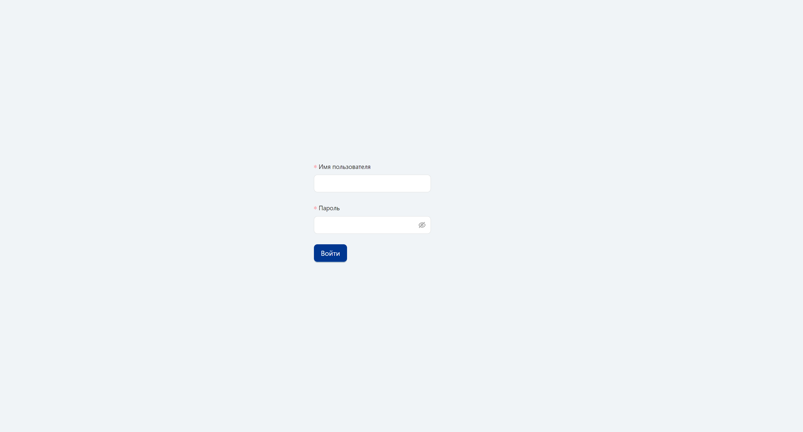
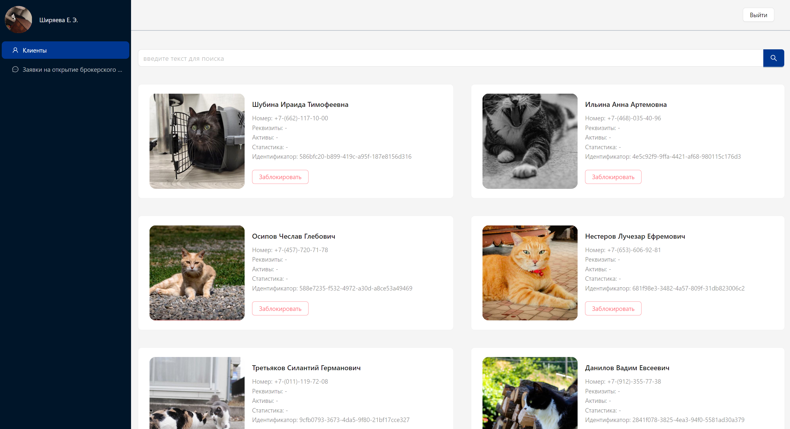
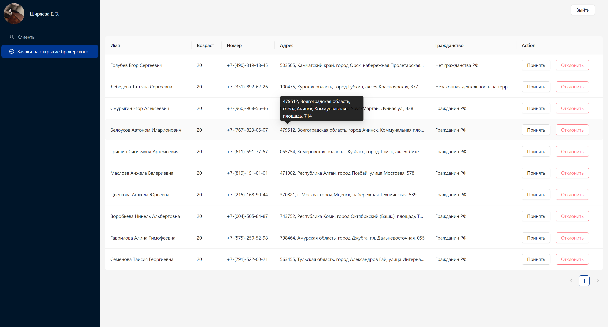

# Админ панель для приложения по проведениям операций на финансовом рынке

## [Демо](https://sovcombank-invest-lambda.github.io/frontend/)

## Использование

1. При первом запуск приложения появиться окно авторизации. Здесь нужно ввести логин и пароль.

2. После успешной авторизации вы попадёте на страницу с клиентами. Здесь вы можете посмотреть информацию о
   пользователях, а также заблокировать/разблокировать их.

3. На странице "Заявки на открытие брокерского счета" вы можете отклонять или принимать заявки на открытие
   брокерского счёта

## Используемые библиотеки

`react@18`

`react-redux` - используется вместе с `@reduxjs/toolkit` для управления состоянием.

`ant-design@4` - используется в качестве фреймворка компонентов. Этот фреймворк, был выбран так как он поддерживает tree
shaking (что важно для небольших проектов) и имеет понятную документацию, что сильно ускорило процесс разработки.

`react-scripts` - для запуска локального сервера и создания бандла.
